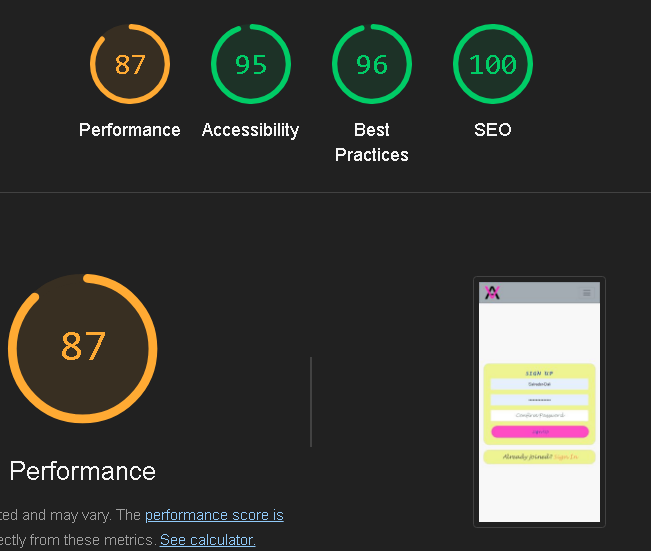
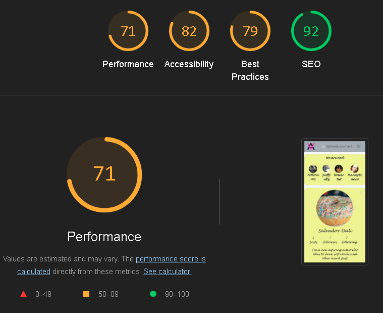

# Virtual Art Gallery

    

    Image generated using <a href="https://ui.dev/amiresponsive" target="_blank">https://ui.dev/amiresponsive</a>

## Project objective

Virtual Art Gallery is a social media website which allows for viual artists and afficionados of art to get together, interact and share their work and ideas. The primary objective of this site is to:
1) Let aspiring artists and creators of visual art (painting, drawing photography etc) to share and describe their work to the public.
2) Allow users of the site to view artwork, like and comment on artwork and each others posts. 
3) Provide a way for artists and other users to interact.
4) Let user review and provide feedback on published artwork.

The live site can be found [here](https://virtual-gallery-b30861137de1.herokuapp.com/)

## Table of contents
- [Virtual Art Gallery](#virtual-art-gallery)
  * [Project Goals](#project-goals)
  * [Table of contents](#table-of-contents)
  * [Agile development methodology](#agile-development-methodology)
  * [Planning](#planning)
    + [Epics](#epics)
    + [User stories](#user-stories-1)
    + [Mockups](#mockups)
    + [Data models](#data-models)
  * [Design](#design)
    + [Colours](#colours)
    + [Fonts](#fonts)
  * [Features](#features)
  * [Mobile Views](#mobile-views)
  * [Desktop and Laptop Views](#desktop-and-laptop-views)
    + [Header](#header)
    + [Landing page](#landing-page)
    + [Sign-up form](#sign-up-form)
    + [Sign-in form](#sign-in-form)
    + [Home Page](#home-page)
    + [Upload Artwork](#upload-artwork)
    + [Edit Artwork](#edit-artwork)
    + [Delete Artwork](#delete-artwork)
    + [Like Artwork](#like-artwork)
    + [Reviews Form](#reviews-form)
    + [Edit Reviews](#edit-comments)
    + [Delete Reviews](#delete-comments)
    + [Profile Page](#profile-page)
    + [Profile Image](#profile-image)
    + [Edit Profile](#edit-profile)
    + [Change Username and password](#change-username-and-password)
    + [Follow Profiles](#follow-profiles)
    + [Top Artists](#top-artists)
    + [Navigation and Pagination](#navigation-and-pagination)
    + [Re-use of components](#re-use-of-components)
    + [CRUD functionality](#crud-functionality)
    + [Future improvements and features](#future-improvements-and-features)
      - [Short term future improvements](#short-term-future-improvements)
      - [Long term future features](#longer-term-future-features)
  * [Frameworks, libraries and dependencies](#frameworks--libraries-and-dependencies)
    + [React-Router-DOM](#react-router-dom)
    + [ReactDOM](#reactdom)
    + [Axios](#axios)
  * [Testing](#testing)
    + [Manual testing](#manual-testing)
    + [Validator testing](#validator-testing)
    + [W3C CSS validator](#w3c-css-validator)
    + [ESLint JavaScript validator](#eslint-javascript-validator)
    + [WAVE web accessability testing](#wave-web-accessability-testing)
    + [Lighthouse testing](#lighthouse-testing)
    + [Other testing](#other-testing)
    + [Resolved bugs](#resolved-bugs)
    + [Unresolved bugs](#unresolved-bugs)
  * [Deployment](#deployment)
  * [Credits](#credits)
    + [Code](#code)
    + [Media](#media)
  * [Acknowledgements](#acknowledgements)

## Agile development methodology

For this project I used a method called Agile to keep track of my progress. For this I used a combination of issues divided into epics and user stories.

The epics describe the most crucial features for the project and they have also been rated accordning to importance, with the most important epics being labeled with a milestone called "priority one". 

The user stories are all related to the epics and have themselves been divided into priority, using the MoSCoW method. This means that the most important features have the label "must-have", a less important but still important feature has the "should-have"-label, an even less important but nice-to-have feature has the "could-have"- label and a feature that has little to no impact on the project will be labeled with a "won't-have"- label.

## Planning
The importance of proper planning became very clear to me when developing a bigger project like this.
GitHub provides powerful and comprehensive tools, such as a Kanban board and the possibility to add a
group of issues to boards called projects. The issues were ordered into EPIC's and User Stories. Each EPIC has a smaller or bigger group of User Stories attached to it, and was provided with milestones and labels accordning to importance. 
All issues were initially placed in the backlog, from where they later were moved to
the proper columns during development.

### Epics
The epics represent the main project parts that includes all related user stories. The epics were all started in the backlog, and then moved into the epics column, where they were elected according to priority(the most important were labelled with a must-have label and a milestone of priority one). During the start of the working process, the epics were moved into the "to-do" column, later to the "in progress" column and when they fill all acceptance criteria of the related user stiories, they were moved to the "done" column. 

### User stories
All the user stories have their related EPICs and are also rated accordning to their 
importance, with the "must-have" being the most important and the "should have" being slinghtly less important, the "could-have" being a nice feature that could be implemented if the deadline allows it and finally the "won't have" which will not be implemented. A full list of the user stories and related EPICs can be found in the [README.md for the drf-api](https://github.com/Dym077/drf-api02)

### Mockups

Initially I sketched wireframes on paper and later I made more detailed ones in Balsamiq to get an overview over the features which had the "must-have"- label assigned to them. This app was developed with the "mobile first" approach, which means it is highly accessible on a mobile device. 

#### Mobile wireframes
As this is a "mobile first" app, I started with the wireframes for the mobile devices.

* Signup and signin page

* Landing page

* Profile page

* Reviews

#### Desktop wireframes

* Signup and signup page

* Landing page

* Post feed

* Profile page

### Data models

Before the building of the front end part of this project, the data models were planned for the back end. The documentation for these models can be found here: [Virtual Art Gallery API](https://github.com/Dym077/drf-api02)

## Design

### Colours

To maintain a highly accessible user interface, the choice of colours are as follows. A brighter background provides a
great contrast to the darker letters and icons on the site. The user experience should be a site with easy access to all features and without any clutter.  

| Colour                                                                   | value            |
|--------------------------------------------------------------------------|------------------|
| Primary colour- used for profile and top artists                         | #effb93          |
| Secondary - used for artwork feed                                        | #8bb8e2          |
| Background - used for navigation bar                                     | #a6acb5          |
| Element1 - used for like-heart                                           | #f85032          |
| Element2 - used for logotype and follow button                           | #ff00ca          |
| Element3 - used for edit and save buttons                                | #2142b2          |
| Element4 - used for review publish button                                | #6a725a          |

### Fonts
Classic fonts were used for this project. For the main text on the site, I used initially "Lucida Handwriting", "Brush Script MT" and when they are not available - sans-serif. Lucida Handwriting has an elegant and classic feel to it, which suits the theme of the project and the overall design well. However it has a thin look to it, which made me consider a font with a more bold style.
Other fonts were less prominent, but well known fonts, such as Verdana, Geneva, Tahoma, sans-serif, which were used for the placeholder text in the searchbar for "Find art".

## Features

### Mobile views

### Sign-up form
With the sign-up form, a new user can provide a unique username and a password. The user will be asked to confirm the password and can then use the sign-in form to access the page.

### Sign-in form
A returning user can use the sign-in form to access the page. By entering the username and the password, the user will be able to login.

### Home page
This is the page the user will be directed to after signing up or signing in. It looks alot like the landing page, but all the features are available to the signed in user.

### Upload Artwork
A user who is logged in can upload artwork, clicking on the mouse area in the navbar, saying "Upload your artwork" From here the user can choose an image and add specifications to it, such as a title, a description and optionally, a location and notes. After clicking the submit button, the artwork will be visible in the feed.

### Like Artwork
Any user who is logged in, can like other users' artwork by clicking on the heart-shaped icon next to the post. The heart will turn red and the post will be visible in the user's feed. If the same user clicks the heart con again, the like will
disappear and the post will not be visible in the user's personal feed. 

### Reviews Form
The reviews form is a function that lets users comment, give feedback and rate on other users' artwork. The user writing the review, can choose a title, add content in the textfield below and also put an integer between 1 & 5 in the rating field. Optionally, it's possible to add tags to the artwork as well.  
The function to let a user review personal artwork, is actually a great way for an artist to give feedback on the review itself, as well as commmunicate with other users.

When all required fields(marked with "*")fields are filled in, the user can click the publish button and the review will be visible under the posted artwork.

### Edit Reviews
In addition a user can choose to edit the review in the same fashion that it's possible to edit profile details and details on artwork. By clicking the pencil icon the edit form will be visible. When all fields have been edited to satisfaction, the user can click the update button and the new content will be visible.

### Profile Page
The profile page is exclusive to each user, and a user can choose to add a short biography, what styles of art might be of interest and also, if they are practicing art themselves, specify what techiques they are using.  When all fields have been filled in, the user can click the save button and all info will be added to the profile page. 

### Edit Profile
The profile details can also be updated at anytime, as well as the profile image. When toggling the tree dots next to the avatar, the user can then edit the profile details and save them. 

### Desktop and Laptop views

### Header
The header contains the logotype and the navbar.

### Landing page
The landing page is the first page the user will see when navigating to the site.
The menu and the feed are visible on the page.

### Sign-up form
With the sign-up form, a new user can provide a unique username and a password. The user will be asked to confirm the password and can then use the sign-in form to access the page.

### Sign-in form
A returning user can use the sign-in form to access the page. By entering the username and the password, the user will be able to login.

### Home page
This is the page the user will be directed to after signing up or signing in. It looks alot like the landing page, but all the features are available to the signed in user.

### Upload Artwork
A user who is logged in can upload artwork, clicking on the mouse area in the navbar, saying "Upload your artwork" 

From here the user can choose an image and add specifications to it, such as a title, a description and optionally, a location and notes. After clicking the submit button, the artwork will be visible in the feed.

### Edit Artwork
A user will be able to edit the details on personal artwork by changing the content in the textfields and update the image to another. After clicking update, the new details and the image will be visible in the feed. 

### Delete Artwork
A user can furthermore, choose to delete the uploaded artwork together with related details. After clicking the delete button, the image and all related info ill be erased.

### Like Artwork
Any user who is logged in, can like other users' artwork by clicking on the heart-shaped icon next to the post. The heart will turn red and the post will be visible in the user's feed. If the same user clicks the heart con again, the like will
disappear and the post will not be visible in the user's personal feed. 

### Reviews Form
The reviews form is a function that lets users comment, give feedback and rate on other users' artwork. The user writing the review, can choose a title, add content in the textfield below and also put an integer between 1 & 5 in the rating field. Optionally, it's possible to add tags to the artwork as well.  
The function to let a user review personal artwork, is actually a great way for an artist to give feedback on the review itself, as well as commmunicate with other users.
When all required fields(marked with "*")fields are filled in, the user can click the publish button and the review will be visible under the posted artwork.

### Edit Reviews
In addition a user can choose to edit the review in the same fashion that it's possible to edit profile details and details on artwork. By clicking the pencil icon the edit form will be visible. When all fields have been edited to satisfaction, the user can click the update button and the new content will be visible.

### Delete Reviews
To delete a review, the user can instead of choosing the pencil icon choose the trashcan icon. After clicking on the delete button, the review will be completely removed. 

### Profile Page
The profile page is exclusive to each user, and a user can choose to add a short biography, what styles of art might be of interest and also, if they are practicing art themselves, specify what techiques they are using.  When all fields have been filled in, the user can click the save button and all info will be added to the profile page. 

### Profile Image
All users will be provided with a default profile image, which they can change at anytime. If the user clicks on the change image button, a window will open where the user can choose a new image. 

### Edit Profile
The profile details can also be updated at anytime, as well as the profile image. When toggling the tree dots next to the avatar, the user can then edit the profile details and save them. 

### Change username and password
Each user also has the ability to change credentials. When toggling the menu for 
changing username and password, a new form will display where the user can choose a new username and password. After clicking save, the new credentials will be saved to the database. 

### Follow Profiles
The follow function lets a user follow other users and get instant access to their updates and newly published artwork. By clicking on the follow button, the user will get posts from the followed user in the personal feed. If a user wishes to unfollow the user, that's done by clicking the the button again.

### Top Artists
A function to display the most followed users on the page. In the column to the right under the heading "We are cool", the profiles which have the most followers are displayed. This list also offers the function to follow and unfollow profiles.

### Navigation
All navigation is easily performed via the navbar at the top of the page. From there, the other pages can be accessed by an authenticated user. 

### Re-use of components
#### Spinner.js
This components was used to render the loading spinner all across the project. When th content on the homepage, the feed of posts or top artists are loaded, the spinner will be visible
#### Avatar.js
This asset is used to display the users profile image, both the default and custom image. This avatar is visible next to the post, review and on the profile page.
#### MoreDropDown.js
Another frequently used asset, which allows for a user to click a dropdown icon and a menu appears. It's used as an exclusive MoreDropdown.js app and re-used in the Post.js app, the ProfilePage.js and in the Review.js app.
#### NavBar.js
Used for easier navigation across the app, allowing the user to navigate to any of the features from the navbar.
#### NotFound.js
If a request is made which is not valid the NotFound component will be returned.

### CRUD functionality
Virtual Art Gallery makes use of full Create, Read, Update and Delete functionality, via the UI implemented in React and the Django Rest Framework API.

- Create - A new user can create a unique user profile and also create posts by uploading artwork to the site. An authenticated user can also like other artists work.
- Read - An authenticated user can view other user's profiles and artwork as well as the personal posts and profile page. An authenticated user can also view reviews on other users' artwork as well as other users' reviews on personal posts.
- Update - authenticated users can update their profile image, username and password, and edit and save details and specs on their previously posted artwork. An authenticated user can also udate their reviews and likes on other users posts/ artwork.
- Delete - authenticated users can delete their previously posted artwork from the site, delete their reviews and likes on other artists work.

### Future improvements and features
Due to time constraints, I had to downscale the project quite a bit, and move an EPIC called Artists to the backlog.
This will probably be a future feature, when a new ser will be able to sign up as a regular user or as an artist.
Looking at the user stories, these should probably e considered "could-haves" and not "must-haves".

#### Short term future improvements
- As an artist, the user should acquire some exclusive features, such as able to receive reviews on their work and chat with 
other user. As for now, all users can upload artwork and be able to receive reviews on their work
- Reviews should be written exclusively for artists and on a dedicated Reviewspage. Instead of a classic numeric rating, the users should be able to rate the artwork with symbols or icons instead.
- Implement a contact form where users can get in contact with an artist to get more information about their work.
- Implement a contact form where user can contact the site administrator.
- User should be able to delete their own profiles.
- Users should get an alert when attempting to delete posts.
- An artist should not have to rate personal artwork to add comments.
- When users are followed and their artwork is being reviewed and/ or liked, they
should be alerted.
- New default images for redular users vs artists.

#### Long term future features
- A feature where users can order artwork from their favourite artists could be implemented in a future iteration of this project.

## Frameworks, libraries and dependencies

### React-Router-DOM
- [react-router-dom](https://www.npmjs.com/package/react-router-dom) This library give the ability of 'client side routing' for React web applications, and is used to implement basic routing in Virtual Art Gallery, such as implementing the links on the navbar, and register, sign-in and sign-out links.

### ReactDOM
- [react-dom](https://www.npmjs.com/package/react-dom) React-dom can provide useful methods to manipulate the DOM outside the React package and render useful elements used in this application.

### React-Bootstrap
- [react-bootstrap](https://react-bootstrap.netlify.app/)
This library was essential to provide the overall styling of the page, ranging from navbars, spinners 
and buttons.
 
### Axios
- [Axios](https://www.npmjs.com/package/axios) The Axios library is used for making a reliable connections between the front end and the back end API.

### JWT Decode
- [jwt-decode](https://www.npmjs.com/package/jwt-decode)
This library was used to decode Base64URL encoded JSON web tokens.

## Testing

### Manual testing
A series of manual tests were performed for each user story to be implemented for the project.The tests were performed on the deployed version of the site.
A complete list of tests of all the functions in the app can be viewed [here](https://docs.google.com/spreadsheets/d/1AI-GBoQKm2L2NoHn1X_w7_F-2xDVtFN0cPtK2XwXiZQ/edit?gid=0#gid=0).

### Validator testing

The page's responiveness was was validated using [Am I Responsive](https://ui.dev/amiresponsive?url=https://virtual-gallery-b30861137de1.herokuapp.com/)

### W3C CSS validator
All CSS files were validated using [W3C CSS Validation Service](https://jigsaw.w3.org/css-validator/)
which returned no errors.

### WAVE Tesing
The page was tested with WAVE which returned no errors, just some contrast errors pointing at elements which are not supposed to be visible in the browser.

### ESLint JavaScript validator
For the validation of the JavaScript files, I initially used the ESLint validation tool.
After installing and running ESLint locally, it returned 68 errors pointing to 
undefined prop-types in the following files: Asset.js, Avatar.js, MoreDropdown.js, NotFound.js, CurrentUserContext.js, ProfileDataContext.js, SignInForm.js, Post.js, PostPage.js, PostsPage.js, PopularProfiles.js, Profile.js, ProfilePage.js, Review.js, ReviewCreateForm.js and ReviewEditForm.js. After adding needed prop-types to the 
JS-files, all errors except one in "main34bd8f9b.js" were resolved.
.png)

### Lighthouse testing

* Lighthouse was used for testing the page load on desktop.
- This is the result for the loading of the signup page:

- Loading the profile page returned the following result:

- When loading the Home page, the following result was returned: 

* Further Lighthouse reports were performed for mobile page load.
- When loading the signup page, the following result was returned:

- For the profile page on mobil devices, we achieved the following result:

- Loading the Home page, returned the following result on mobile devices:

### Other testing

The site has been tested on different devices, inluding Android, iPhone, desktop and laptop computers, and with browsers such as Mozilla Firefox, Google Chrome, Microsoft Edge and Safari. The site is fully responsive on all devices. Worth noting is, that during responsiveness testing in devtools with dimensions being 387 x 599, the navbar tends to slightly hide the heading for top artists, capping the text "We are cool" slightly. 

### Resolved bugs
- The tooltip which prompts the user to enter an integer between 1 & 5 in the rating field, for some reason didn't show on the deployed version of this app.
- [Rating](documentation/rating_integer.png)

 - The DOM returns a NaN message when a user submits a comment on another user's post. The reason for this error is not to be found in the front end, but should be caused when the integer from the API isn't properly read by the DOM, believing it to be a string rather than an integer. The culprit was revealed to be the serializer in the Postserializer model for the backend API missed a comments_count field so the Post model was not annotated with comments_count field. Thanks to help from tutor support we were able to pinpoint this bug and fix it.
 - 
One of the most frustrating bugs I encountered during development and testing of the API, was an axioserror which was related to the "reviews" model. When attempting to post a review from the ReviewCreateForm on selected artwork, the devtools console returned "AxiosError Bad Request" For some reason, the front end could not communicate at all with the API.
The reason for this bug was in the front end of this project. Because there were only one field for the review implemented, and the API requires four fields, the digital handshake could not be executed properly. This bug is also mentioned in the readme for the API, but was actually caused in the front end. 

### Unresolved bugs
No unresolved bugs reported. However, the ESLint testing returned one error which couldn't be located and resolved properly.

## Deployment
Deployments to Heroku can be dome following theses steps:

- Fork or clone the repository in GitHub.
- If you have also cloned and deployed your own version of the backend API, you will need to ensure the value of `axios.defaults.baseURL` in `src/api/axiosDefaults.js` is set to the base URL for your API. Pull to your local development environment and push back to GitHub if necessary; otherwise, leave as is to use the original API.
- Log in to your Heroku account.
- Select 'Create new app' from the 'New' menu at the top right.
- Enter a name for the app and select the region you are located in.
- Select 'Create app'.
- Select the 'Deploy' tab at the top.
- Select 'GitHub' from the deployment method options to confirm you wish to deploy using GitHub. You may be asked to enter your GitHub password.
- Find the 'Connect to GitHub' section and use the search box to locate your repo.
- Select 'Connect' when you have found your repo.
- Optionally, you may choose the main branch under 'Automatic Deploys' and select 'Enable Automatic Deploys' if you want your deployed site to be automatically redeployed every time you push changes to GitHub.
- Find the 'Manual Deploy' section, choose 'main' as the branch to deploy and select 'Deploy Branch'.

When deployment is complete, you will be given a link to the deployed site.

* How to clone a repository on GitHub:(Source: GitHub)
1. Navigate to GitHub
2. In the dropdown menu, choose "clone repository".
3. Click the tab that corresponds to the location of the repository you want to clone. You can also click URL to manually enter the repository location.
4. From the list of repositories, click the repository you want to clone.
5. To select the local directory into which you want to clone the repository, next to the "Local Path" field, click "Choose", and navigate to the directory.
6. At the bottom of the "Clone a Repository" window, click Clone.
* How to fork a repository on GitHub:
1. At the bottom of the "Clone a Repository" window, click Clone.
2. Click the tab that corresponds to the location of the repository you want to clone. You can also click URL to manually enter the repository location.
3. From the list of repositories, click the repository you want to clone.
4. To select the local directory into which you want to clone the repository, next to the "Local Path" field, click Choose... and navigate to the directory.
5. At the bottom of the "Clone a Repository" window, click Clone.
6. Read the information in the "How are you planning to use this fork?" window.
If you plan to use this fork for contributing to the original upstream repository, click To contribute to the parent project.
If you plan to use this fork for a project not connected to the upstream, click For my own purposes.
7. Click Continue.
You can read extensively on how to clone or fork a repository [here](https://docs.github.com/en/desktop/adding-and-cloning-repositories/cloning-and-forking-repositories-from-github-desktop)

## Credits

### Code
I did not rely heavily on external sources when building this project. I more or less stuck to the material provided by the educators and Code Institute's "Moments" walkthrough. However, I found these online sources useful to find solutions to errors and for general troubleshooting:
* Stack Overflow [Handling Axios Errors](https://stackoverflow.com/questions/49967779/axios-handling-errors)

* This documentation was built from a template, heavily inspired by [TribeHub React](https://github.com/andy-guttridge/tribehub_react/blob/main/README.md)

I also found inspiration, looking at these users' work:
- [Sourdoughcircle](https://github.com/Hujanen91/sourdoughcircle_frontend/tree/main)
- [Star Review](https://star-review-app-fb4aac8cda63.herokuapp.com/)

### Media
Most of the styling and visual elements are relying on the React-Bootstrap library.
Some additional cumponenents are custom elements which I designed myself.
* The Virtual Art Gallery logotype and the default profile avatar were made using [Affinity Designer](https://affinity.serif.com/en-us/designer/)
* Additional photographs, used for the signup and signin pages were taken by 
the developer using a Nikon D600 digital camera.

## Acknowledgements
- My mentor Jubril for his step-by-step guidance and advice.
- The Slack community, which is a great source for help and support.
- The kind tutors at Code Institute